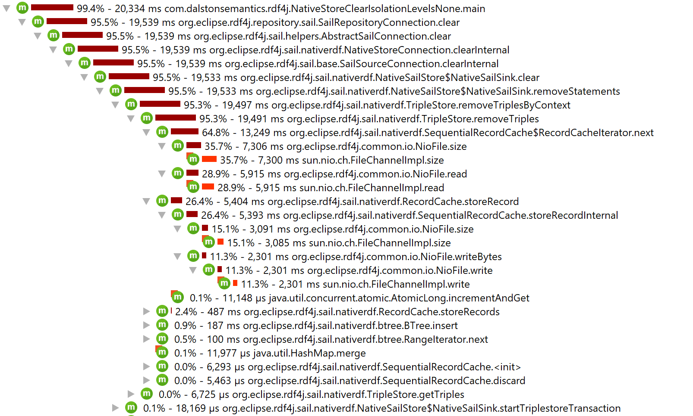

# Test code to reproduce Rdf4j Issue 3806

Issue: https://github.com/eclipse/rdf4j/issues/3806

## Timing clear() call

 1. Clear contents of `./data`
 1. Run `NativeStoreAdd`
 1. Start Docker container with Docker Compose (default _JAVA_OPTIONS include JProfiler agent)
 1. Connect to profiler

## Initial results without named Docker volumes (profiled) with 3.7.7

 1. Observe the results (for 10K records takes just under 20 seconds in the container versus just under a 1 second directly outside Docker):

 

## Results without named Docker volumes with 3.7.7

```
[main] INFO com.dalstonsemantics.rdf4j.NativeStoreAdd - Creating statements.
[main] INFO com.dalstonsemantics.rdf4j.NativeStoreAdd - Statements created. Duration: 6074
[main] INFO com.dalstonsemantics.rdf4j.NativeStoreClear - Calling connection.clear().
[main] INFO com.dalstonsemantics.rdf4j.NativeStoreClear - Completed connection.clear(). Duration: 20129
```

## Results with named Docker volumes with 3.7.7

Fairly significant speed up:

```
[main] INFO com.dalstonsemantics.rdf4j.NativeStoreAdd - Creating statements.
[main] INFO com.dalstonsemantics.rdf4j.NativeStoreAdd - Statements created. Duration: 999
[main] INFO com.dalstonsemantics.rdf4j.NativeStoreClear - Calling connection.clear().
[main] INFO com.dalstonsemantics.rdf4j.NativeStoreClear - Completed connection.clear(). Duration: 395
```

## Results without named Docker volumes with 4.0.0-M3

```
[main] INFO com.dalstonsemantics.rdf4j.NativeStoreAdd - Creating statements.
[main] INFO com.dalstonsemantics.rdf4j.NativeStoreAdd - Statements created. Duration: 5644
[main] INFO com.dalstonsemantics.rdf4j.NativeStoreClear - Calling connection.clear().
[main] INFO com.dalstonsemantics.rdf4j.NativeStoreClear - Completed connection.clear(). Duration: 20074
```

## Results without named Docker volumes with 4.0.0-SNAPSHOT (off https://github.com/eclipse/rdf4j/tree/GH-3806-native-store-clear-slow)

```
13:16:22.191 [main] INFO com.dalstonsemantics.rdf4j.NativeStoreAdd - Creating statements.
13:16:27.628 [main] INFO com.dalstonsemantics.rdf4j.NativeStoreAdd - Statements created. Duration: 5437
13:16:27.760 [main] INFO com.dalstonsemantics.rdf4j.NativeStoreClear - Calling connection.clear().
13:16:28.334 [main] INFO com.dalstonsemantics.rdf4j.NativeStoreClear - Completed connection.clear(). Duration: 574
```